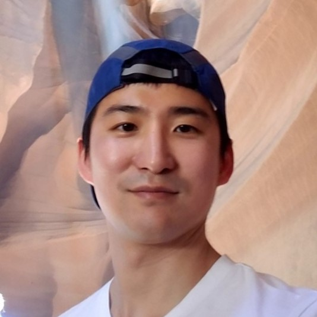

# Heonsoo Lee

[Works](#works) - [Education](#education) - [Publications](#publications) - [Talks](#talks)

Computational Neuroscientist ([github](https://github.com/heonslee) - [linkedin](https://www.linkedin.com/in/heonsoo-lee-167b7048/) - [google scholar](https://scholar.google.com/citations?user=tkmSmY8AAAAJ&hl=en))

  I am a computational neuroscientist, analyzing and simulating neuronal firing activity and EEG data. My research focuses on dynamical patterns in unconscious states (anesthesia, sleep, and disorders of consciousness) and their impact on machine learning tasks of spiking neural networks. Recurrent spiking neural network is constructed and forced to generate dynamic patterns of conscious and unconscious state while performing various machine learning tasks. This will suggest how and why slow oscillations and ordered neural network dynamics are highly associated with unconsciousness or cognitive deficits.

  My past research focused on mechanisms of loss and recovery of consciousness. The investigations covered from firing activity of neural networks at the mesoscopic level to multi-channel EEGs at the macroscopic level. I postulated that the conscious brain operates near critical state (i.e., being at the boundary between order and disorder) and anesthetized or damaged brains would be far away from critical state. My approach included measuring statistical interdependency and information flow between brain signals (and between neurons), graph theoretical analysis, nonlinear dynamical methods, and computational modeling of brain signals. I have also worked on development of medical device for monitoring consciousness. A novel analytic method for measuring connectivity complexity between brain regions was proposed, and further developed as a brain monitoring algorithm. Its clinical usefulness under anesthesia has been demonstrated. 

# works
* 2022-present: Clinical Research Scientist, LVIS
* 2021-2022: Research Scientist, Natural Intelligence
* 2016-2021: Postdoctoral Researcher, University of Michigan Medical School
* 2011-2013: Visiting Scholar, University of Michigan Medical School
* 2011: Visting Scholar, Korea Institute of Science and Technology

# education
* Ph.D in Physics (nonlinear dynamics and complex systems), POSTECH, 2015
* B.S. in Biology and Physics, Sungkyunkwan University, 2009

# publications

- Tanabe S, Lee H, Wang S, Hudetz AG. (2022) Stimulus-evoked cortical spike sequences are resilient to anesthesia. In Preparation

- Joo P, Lee H*, Wang S, Kim S, Hudetz AG. (2021) [Network model with reduced metabolic rate predicts spatial synchrony of neuronal activity](https://doi.org/10.3389/fncom.2021.738362). Frontiers in Computational Neuroscience, 86

- Lee H, Tanabe S, Wang S, Hudetz AG. (2021) [Differential effect of anesthesia on visual cortex neurons with diverse population coupling](https://www.sciencedirect.com/science/article/abs/pii/S0306452220307697?via%3Dihub). Neuroscience, 458 (15), 108-119

- Lee H, Wang S, Hudetz AG. (2020) [State-dependent cortical unit activity reflects dynamic brain state transitions in anesthesia](https://www.jneurosci.org/content/40/49/9440). The Journal of Neuroscience, 40 (49), 9440-9454

- Hudetz AG, Pillay S, Wang S, Lee H. (2020) [Desflurane anesthesia alters cortical layer-specific neuronal interactions in rat cerebral cortex](https://pubs.asahq.org/anesthesiology/article/132/5/1080/109040/Desflurane-Anesthesia-Alters-Cortical-Layer). Anesthesiology, 132 (5), 1080-1090

- Kim S, Jung WS, Lee H, Noh GJ, Cha KC, Kim JK, Lee JK. (2019) [Methods and apparatus for monitoring consciousness](https://patents.google.com/patent/US10506970B2/en). US Patent (granted) 

- Lee H, Golkowski, D Jordan, S Berger, R Ilg, J Lee, Mashour GA, Lee U. (2019) [Relationship of critical dynamics, functional connectivity, and states of consciousness in large-scale human brain networks](https://doi.org/10.1016/j.neuroimage.2018.12.011). Neuroimage, 188, 228-238

-  Lee H*, Zirui H, Liu X, Lee U, Hudetz AG. (2018) [Topographic reconfiguration of local dynamics and shared information after propofol-induced unconsciousness](https://doi.org/10.3390%2Fe20070518). Entropy, 20 (7), 518

- Hwang E, Lee H, Choi J. (2018) [Desynchronization of theta rhythms in the prefrontal cortex and hippocampus on ICSS mice](https://doi.org/10.5607%2Fen.2018.27.3.181). Experimental Neurobiology, 27 (3), 181-188

- Lee H*, Noh GJ, Joo P, Choi BM, Silverstein BH, Kim M, Wang J, Jung WS, Kim S. (2017) [Diversity of functional connectivity patterns is reduced in propofol-induced unconsciousness](https://onlinelibrary.wiley.com/doi/abs/10.1002/hbm.23708). Human brain mapping, 38 (10), 4980-4995 

- Wang J, Noh GJ, Choi BM, Ku SW, Joo P, Jung WS, Kim S, Lee H*. (2017) [Suppressed neural complexity during ketamine- and propofol-induced unconsciousness](https://www.sciencedirect.com/science/article/pii/S030439401730441X). Neuroscience letters, 653, 320-325 

- Kim S, Jung WS, Lee H, Noh GJ, Cha KC, Kim JK, Lee JK. (2016) [의식 상태 모니터링 방법 및 장치, Methods and apparatus for monitoring consciousness](https://patents.google.com/patent/KR101939574B1/ko). Korea Patent (granted) 

- Kim S, Lee H. (2016) [뇌파 신호간 정보 흐름 측정 장치, Information flow measuring apparatus](https://patents.google.com/patent/KR20160114406A/ko). Korea Patent (granted)

- Pal D, Silverstein BH, Lee H, Mashour GA. (2016) [Neural correlate of wakefulness, sleep, and general anesthesia](https://pubs.asahq.org/anesthesiology/article/125/5/929/19746/Neural-Correlates-of-Wakefulness-Sleep-and-General). Anesthesiology, 125 (5), 929-942

- Wang J, Lee H*, Kim S. (2015) [Assessing performance of directed functional connectivity measures in the presence of common source](https://bmcneurosci.biomedcentral.com/articles/10.1186/1471-2202-16-S1-P124). BMC neuroscience, 16 (1), 124

- Lee H, Mashour GA, Noh GJ, Kim S, Lee U. (2013) [Reconfiguration of network hub structure after propofol-induced unconsciousness](https://doi.org/10.1097/aln.0b013e3182a8ec8c). Anesthesiology, 119 (6), 1347-1359

- Blain-Moraes S, Mashour GA, Lee H, Huggins JE, Lee U. (2013) [Altered cortical communication in amyotrophic lateral sclerosis](https://doi.org/10.1016/j.neulet.2013.03.028). Neuroscience Letters, 543, 172-176

- Lee U, Lee H, Muller M, Noh GJ, Mashour GA. (2012) [Genuine and spurious phase synchronization strengths during consciousness and general anesthesia](https://journals.plos.org/plosone/article/figure?id=10.1371/journal.pone.0046313.g002). PLOS One, 7, e46313

# talks

- Neuronal dynamics in visual cortex under conscious and anesthetized conditions. Workshop on Scientific Study of Consciousness (2020), Tucson, AZ, USA

- Effects of anesthesia on coordinated neuronal activity and information processing in rat primary visual cortex. Organization for Computational Neuroscience (2019), Barcelona, Spain

- Connectivity complexity in pharmacologically and pathologically induced altered states of consciousness. Mini-Workshop on Scientific Study of Consciousness (2018), Tucson, AZ, USA

- Reconfiguration of functional connectivity patterns after administration of hypnotic agents. Seoul International Conference on Anesthesiology (2014), Seoul, South Korea

- Reconfiguration of network hub structure after anesthetic-induced unconsciousness. Postech-Kyutech Joint Workshop on Neuroinformatics (2014), Kitakyshu, Japan

